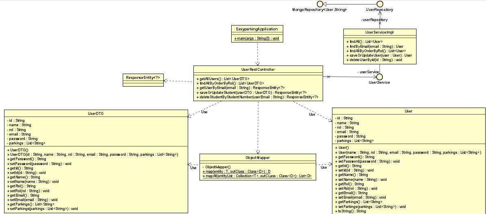

# Easy-Parking-SPRINT-2-backend

# Diseño

## Modelo de dominio - (dominio - servicio - controlador - persistencia) User

<p align="center">
    
</p>

# Empezar

cargue las dependencias con:

```
mvn package
```

ejecute el servicio REST con cualquiera de los dos comandos:

```
java -jar target/easyparking-0.0.1-SNAPSHOT.jar
```

```
mvn spring-boot:run
```
